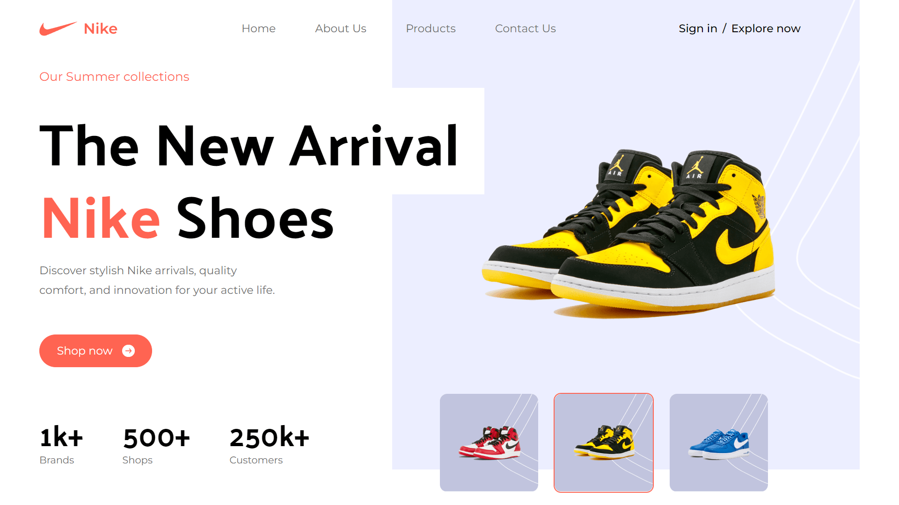

<div align="center">
    <a href="https://nike-fv.netlify.app" target="_blank">
      
    </a>
  <h3 align="center">Nike UI</h3>
</div>

##  <br /> 📋 <a name="table">Table of Contents</a>

- ✨ [Introduction](#introduction)
- ⚙️ [Tech Stack](#tech-stack)
- 📝 [Features](#features)
- 🚀 [Quick Start](#quick-start)

##  <br /> <a name="introduction">✨ Introduction</a>

**[EN]** Modern Nike landing page designed with React and Tailwind CSS, featuring a visually appealing hero section, popular products showcase, unique "About Us" section, special offers display, testimonials, and a newsletter integration. This project maximizes Tailwind CSS with best practices, theming techniques, and JavaScript-like tasks. The entire site is mobile-responsive, highlighting Tailwind's flexibility and design capabilities.

**[FR]** Page d'accueil moderne pour Nike, conçue avec React et Tailwind CSS. Ce projet comprend une section héro captivante, une présentation des produits populaires, une section "À propos" originale, des offres spéciales, des témoignages, et une intégration de la newsletter. Il optimise l'utilisation de Tailwind CSS avec des bonnes pratiques, des techniques de thématisation et des effets interactifs habituellement réalisés avec JavaScript. Le site est entièrement responsive, mettant en valeur la flexibilité et les capacités de design de Tailwind.

##  <br /> <a name="tech-stack">⚙️ Tech Stack</a>

- [**React**](https://react.dev/reference/react) is a popular JavaScript library for building user interfaces, particularly single-page applications where data changes over time. React's component-based architecture allows developers to create reusable UI components, making development more efficient and the codebase easier to maintain. Its virtual DOM enhances performance by minimizing direct interactions with the browser's DOM.

- [**Tailwind**](https://v2.tailwindcss.com/docs) is a utility-first CSS framework that speeds up UI development by providing a set of pre-built utility classes. It allows developers to quickly build custom designs without writing traditional CSS, promoting rapid prototyping and design consistency.

- [**Vite**](https://vitejs.dev/guide/) is a modern frontend build tool known for fast ES Module imports, efficient bundling, and quick development server startup times. It supports frameworks like Vue.js and React, optimizing workflow and performance compared to traditional bundlers.


## <br/> <a name="features">📝 Features</a>

👉 **Maximizing Tailwind CSS**: Discover tips and tricks to make the most out of Tailwind CSS.

👉 **Understanding Tailwind Internals**: Dive into the inner workings of Tailwind, gaining insights into its structure and optimizations.

👉 **Best Practices**: Learn Tailwind's best practices for efficient and maintainable code.

👉 **Theming**:Explore techniques to add different themes to your website using Tailwind CSS.

👉 **JavaScript-like Tasks with Tailwind**: Discover how Tailwind CSS can be used to achieve tasks that typically require JavaScript code

while building a beautiful Nike Website with a,

👉 **Complex Hero Section**: A visually appealing hero section showcasing key elements.

👉 **Popular Products Showcase**: A section highlighting popular Nike products

👉 **About Us Section**: An informative "About Us" section with a unique design.

👉 **Special Offers**: Showcase special offers in an eye-catching manner

👉 **Testimonials**: A testimonials section for a captivating user experience

👉 **Newsletter Integration**: A newsletter section with Tailwind styling, encouraging user engagement

👉 **Footer**: A comprehensive footer section containing various links

👉 **Mobile Responsive**: The entire website is responsive across various devices, emphasizing Tailwind's mobile-friendly capabilities.

## <br /> <a name="quick-start">🚀 Quick Start</a>

Follow these steps to set up the project locally on your machine.

<br/>**Prerequisites**

Make sure you have the following installed on your machine:

- [Git](https://git-scm.com/)
- [Node.js](https://nodejs.org/en)
- [npm](https://www.npmjs.com/) (Node Package Manager)

<br/>**Cloning the Repository**

```bash
git clone {git remote URL}
```

<br/>**Installation**

Let's install the project dependencies, from your terminal, run:

```bash
npm install
# or
yarn install
```

<br/>**Running the Project**

Installation will take a minute or two, but once that's done, you should be able to run the following command:

```bash
npm run dev
# or
yarn dev
```

Open [`http://localhost:5173`](http://localhost:5173) in your browser to view the project.